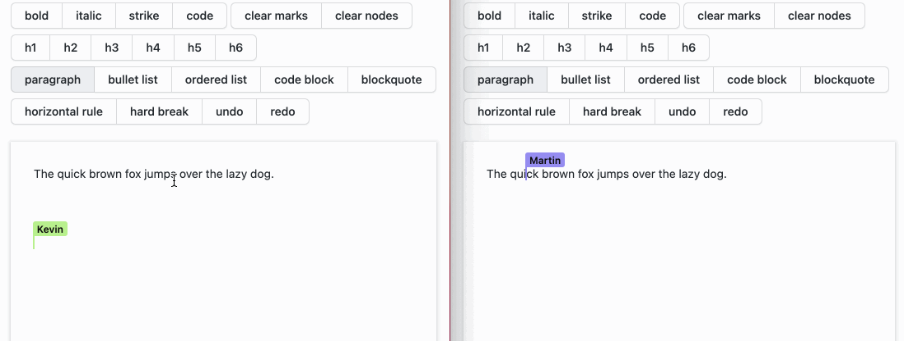

# Nostr CRDT

[](https://badge.fury.io/js/nostr-crdt) [](https://coveralls.io/github/YousefED/nostr-crdt?branch=main)

**nostr-crdt** is an experiment to run decentralized, collaborative (multiplayer) apps over [nostr](https://github.com/nostr-protocol/). CRDT application updates are sent as Nostr events.

The NostrProvider is a sync provider for [Yjs](https://github.com/yjs/yjs), a proven, high performance CRDT implementation.

## TL;DR

Create apps like this and run them over Nostr:



## Live demo

In the [examples](examples) directory, you'll find some live examples:

- [Collaborative Todo list](examples/todo-simple-react)
- [Collaborative rich text editing](examples/rich-text-tiptap)

## Summary of how it works

When using [CRDTs](https://crdt.tech/) (_Conflict-free Replicated Data Types_), you don't need to store "the current application state" in a central database. Instead, the state is derived from all updates that have been made.

Nostr-crdt shares these updates using the [Nostr protocol](https://github.com/nostr-protocol/) as _events_. Instead of social updates or chat messages (main use-case for nostr), we send an event stream of data model updates (for the rich-text demo for example, updates are "rich-text document edits", for the TODO-list examples, updates are the creation or completion of todo items) over the Nostr protocol.

The main code to create a simple, collaborative TODO list on top of nostr-crdt is < 100 lines (see [App.tsx](examples/todo-simple-react/src/App.tsx)).

An initial event is created to define a "room" (like a document or todo-list). Updates to this room are sent by creating nostr events with an `#e` tag to the initial event id (room id).

Updates could be spread across relays, or stored locally in clients and synced at a later moment.

# Usage

nostr-crdt currently works with [Yjs](https://github.com/yjs/yjs) or [SyncedStore](https://www.syncedstore.org).

## Usage with Yjs

To setup nostr-crdt, 3 steps are needed:

- Create a [Yjs](https://github.com/yjs/yjs) `Y.Doc`
- Connect to a relay using [nostr-tools](https://github.com/nbd-wtf/nostr-tools)
- Create and initialize your nostr-crdt `NostrProvider`

```typescript
import { NostrProvider, createNostrCRDTRoom } from "nostr-crdt";
import { generatePrivateKey, relayInit } from "nostr-tools";
import * as Y from "yjs";

const nostrClient = relayInit("wss://nostr-url");
await nostrClient.connect();
const key = generatePrivateKey();
const ydoc = new Y.Doc();

// Send a first event using Nostr to create a new "room"
// (not necessary when joining an existing room)
const roomId = await createNostrCRDTRoom(doc, nostrClient, key, "demo");

// Create and connect the NostrProvider to the Y.Doc
const nostrProprovidervider = new NostrProvider(
  doc,
  client,
  key,
  roomId,
  "demo"
);
await provider.initialize();

// array of numbers which produce a sum
const yarray = ydoc.getArray("count");

// observe changes of the sum
yarray.observe((event) => {
  // print updates when the data changes
  console.log("new sum: " + yarray.toArray().reduce((a, b) => a + b));
});

// add 1 to the sum
yarray.push([1]); // => "new sum: 1"
```

# Local-first

Note that you don't _need_ to have a connection to a Relay for the demo apps to work. With nostr-crdt you can build local-first apps, and sync over nostr as soon as you're back online.

> Read more about [the benefits of Local-first software in this essay](https://www.inkandswitch.com/local-first.html)

# Future work

The current state is a proof of concept to gather community feedback. Brainstorm of future work necessary:

- a NIP for events (we now use kind=9001)
- periodic snapshots of events
- how to handle long-term storage, do we need specific relays / NIPs for this?
- design for access control (who can collaborate on the same "document" / room)
- send presence / cursor info as ephemeral events
- buffer stored events every x seconds, and send "live" data as ephemeral events to reduce network load
